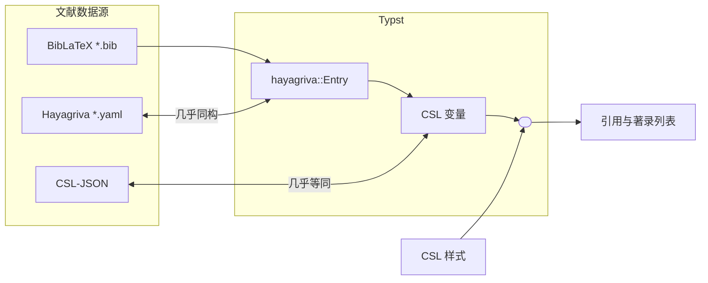

# Hayagriva 对 Bib(La)TeX `*.bib`格式的兼容性

## 参考文献处理原理

Typst 的 [bibliography 函数](https://typst.app/docs/reference/model/bibliography/)支持两种文献数据格式：[Hayagriva `*.yaml`](https://typst-community.github.io/extra-docs/hayagriva/file-format.html)与 [BibLaTeX `*.bib`](https://mirrors.ctan.org/macros/latex/contrib/biblatex/doc/biblatex.pdf#section.2)[^biblatex]。无论哪种格式，Typst 内部都会先转换为[`hayagriva::Entry`](https://docs.rs/hayagriva/latest/hayagriva/struct.Entry.html)，然后用它匹配 CSL 样式，计算所需 CSL 变量，最终生成引用与著录列表。Hayagriva `*.yaml`就是针对`hayagriva::Entry`设计的，所以二者几乎同构。

[^biblatex]: LaTeX 采用`*.bib`记录文献数据，主要有 BibTeX 与 BibLaTeX 两类处理方法。两类方法对`*.bib`的要求大体一致，只有些细节区别。例如硕士与博士论文，BibTeX 分别用`@masterthesis`与`@phdthesis`，而 BibLaTeX 统一用`@thesis`并标注`type`字段。这两类方法一般统称 Bib(La)TeX，经常也简化称作 BibTeX。Typst 所支持的`*.bib`名义上是 BibLaTeX。

Hayagriva 在开发模式（`--features csl-json`）还支持第三种数据格式：[CSL-JSON](https://citeproc-js.readthedocs.io/en/latest/csl-json/markup.html)。这种格式用于 CSL 测试集，几乎直接记录了各种 CSL 变量的值。

Typst 及 Hayagriva 处理参考文献的原理总结如下图。



## 测试范围

参考以上原理图，此部分与主页面的测试范围不相交。

- 主页面：(CSL-JSON, CSL 样式) ↦ 引用与著录列表
- 此部分：BibLaTeX `*.bib` ↦ Hayagriva `*.yaml`

由于此部分不直接对应最终输出，故只检查信息丢失。像[`institution`理解成`publisher`还是`authority`](https://gap.zhtyp.art/#publisher-alias)这样的映射争议不在测试范围内。

## 测试用例

从若干项目汇集而来，请参考[`fixtures/*.md`](./fixtures/)。

## 测试方法

1. 运行`nu setup-fixtures.nu`，获取测试用例中的 Bib(La)TeX `*.bib`。
2. 运行`uv run convert.py`，调用 Hayagriva 将上一步`*.bib`转换为`*.yaml`。
3. 将上一步 stdout 发送给任意大语言模型，并附以下提示。（不过因为内容较长，在部分平台可能触发「这个问题我暂时无法回答」。）
4. 结合相关说明文档验证情况，总结最小例子。

```markdown
请检查 bib → yaml 转换时丢失的信息。

丢失信息的例子：
- 某个字段既未原样抄录，也未重命名，而是直接忽略了。
- 某个字段原有三种取值，其中两种被合并了。
- 某个字段是列表，原本有五项，但转换时把最后两项强行拼成一项了。

不算丢失信息的例子：
- 某个字段的键或值被重命名。
- `url`、`urldate`转成`url.value`、`url.date`。

另外注意，bib中的文献类型（例如`@article`）也算一个字段，它转成 yaml 中的`type`与`parent.type`字段可能也有问题。
```

## 测试结果

请移步[`result.md`](./result.md)。
